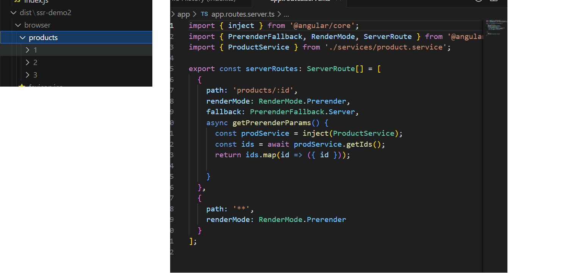
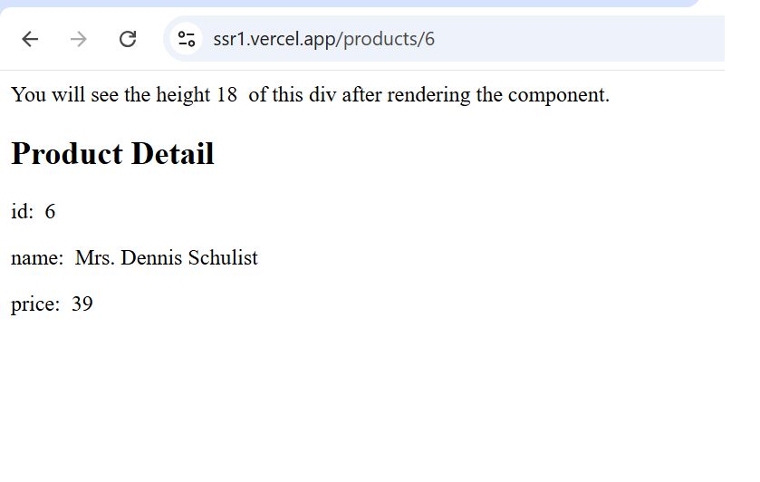
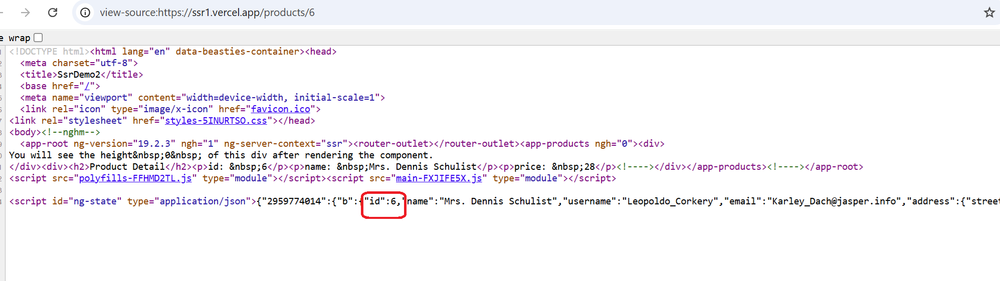

# ssr. angular

## setup

```
node node-main.js
```

## main features

## Screenshots

I have intentionally prerendered three products with IDs (1, 2, 3), while other product pages are generated through Static Site Generation (SSG), as shown in the figure. The server - side rendered page source directly contains the complete data. This eliminates the need for the browser to download and parse JavaScript, significantly improving the page loading speed and enhancing the user experience.




